# 🔒 PyTestGuard

**LLM-powered test generation for Python — with support for both `pytest` and `unittest`.**

**PyTestGuard** is plugin for **PyCharm** that generates unit tests for Python methods using **Gemini 2.0 Flash**. By analyzing the function body and its context, PyTestGuard produces test cases, saving developers time all directly within the IDE.

---

## Features

* **LLM-based test generation** – Uses **Gemini 2.0 Flash** to analyze your code and generate relevant test cases.
* **Context-aware prompts** – Sends function body + surrounding context to have better results from the LLM.
* **Integrated with PyCharm** – Access directly via right-click.
* **Supports both `pytest` and `unittest`** – Choose your preferred framework when generating tests.
* **Test smell detection** (powered by [PyNose](https://github.com/JetBrains-Research/PyNose)) - Identifies common maintainability issues in test code and provides actionable feedback.
* **Inspections for common LLM-generated test issues**
---
## Usage

### Generating tests

To generate unit tests for a function, you have to right-click on the function body and then choose **"Generate Tests"**.

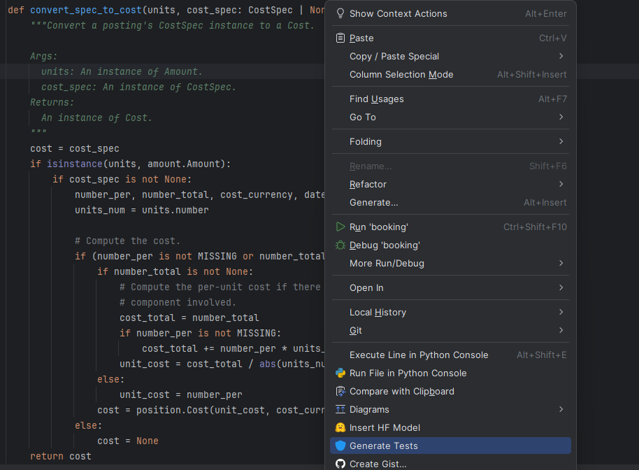

Next, you have to select the test framework between `pytest` and `unittest` and then click on **Ok**.

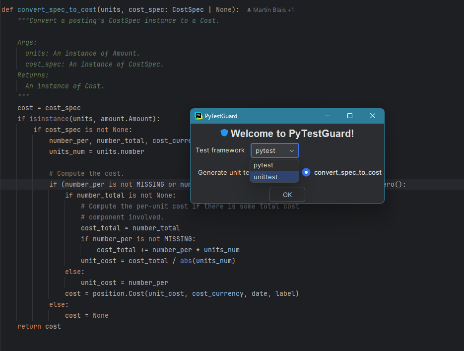

After the background task is done, the generated tests are shown on the right side of PyCharm.

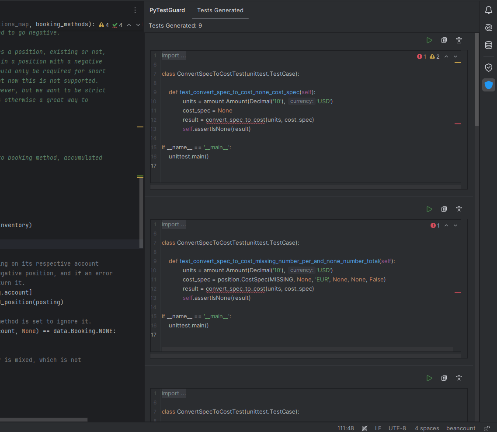

### Test Smell Detection
PyTestGuard automatically detects and highlights the following test smells:
* **Assertion Roulette**
* **Constructor Initialization**
* **Duplicate Assert**
* **Empty Test**
* **Magic Number Test**
* **Redundant Assertion**
* **Obscure In-Line Setup**
* **Unknown Test**

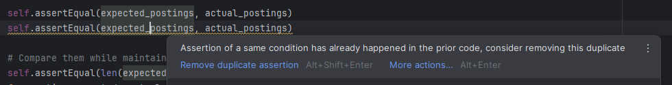

> Powered by [**PyNose**](https://github.com/JetBrains-Research/PyNose), a test smell detector tool for Python.

### Issues in LLM-Generated Tests
PyTestGuard flags as inspections common shortcomings found in LLM-generated unit tests:

| Issue                       | Description                                                         |
| --------------------------- |---------------------------------------------------------------------|
| Syntax Error                | Missing parentheses, colons, or invalid syntax                      |
| Wrong Input Type            | Passing incorrect types to valid function calls                     |
| Empty/Incomplete Generation | Blank test methods or truncated results                             |
| Incorrect Parameters        | Wrong number/type of arguments in method calls                      |
| Hallucinated Object         | Referencing non-existent variables or classes            |
| Wrong/Missing Import        | Test code relies on libraries that are never imported      |
| Unused Code                 | Dead or irrelevant lines generated by the LLM               |
| Underused Assertions        | Incomplete usage of testing APIs (e.g., `assertTrue`, `assertEqual`) |

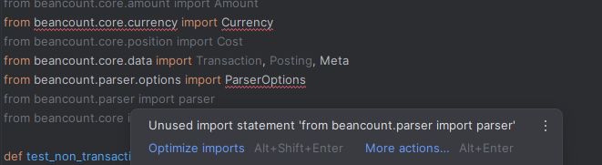
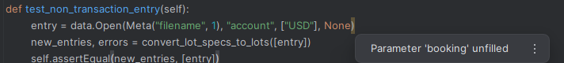
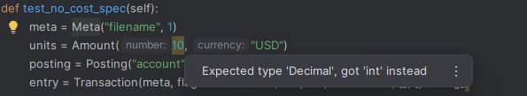
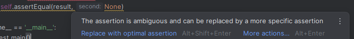

### Test Execution & Coverage Reporting

PyTestGuard lets you running tests and provides indication whether the tests have passed or not.

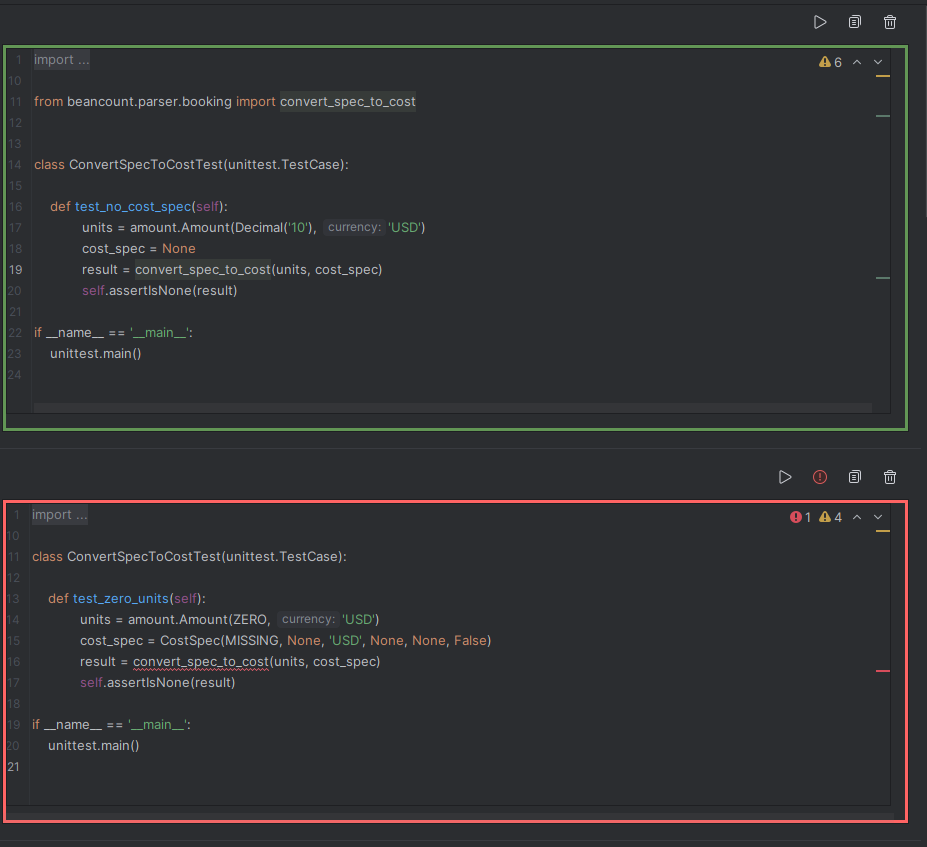

In case of failure, by hovering the error icon a dialog will show a summary of the execution message. When you click the error icon, the complete execution message will be copied to your clipboard for further analysis.
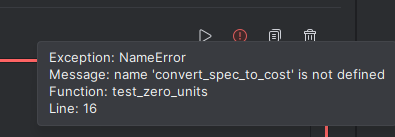

If you switch to the Coverage tab, you can view the statement coverage of the generated test. Additionally, if enabled in the settings, you wll also see the statement coverage change, which is the percentage of new coverage this test contributes to the overall test suite.
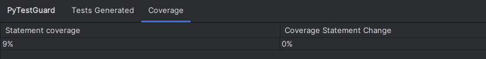

## Installation

1. Download the [latest release](https://github.com/nmouman/PyTestGuard/releases/latest) and install it manually using
   **Settings → Plugins → ⚙️ → Install plugin from disk...**
2. Restart PyCharm.
3. Set **API key** in the settings for using **Gemini 2.0 Flash**
3. Right-click on a function and choose:
   **Generate Tests**

To ensure PyTestGuard works optimally, we recommend enabling its dedicated inspection profile:

1. Go to **Settings → Editor → Inspections → ⚙️ → Import profile...**
2. Select **`PyTestGuard.xml`** which you can download [here](https://github.com/nmouman/PyTestGuard/blob/main/PyTestGuard.xml)
3. Apply and restart PyCharm

This activates all relevant inspections and test smell checks tailored for LLM-generated unit tests.

---

## 📄 License

This project is licensed under the [MIT License](LICENSE).

---

## Acknowledgments

This software includes portions of code adapted from [TestSpark](https://github.com/JetBrains-Research/TestSpark), which is licensed under the MIT License.

---

Plugin based on the [IntelliJ Platform Plugin Template][template].

[template]: https://github.com/JetBrains/intellij-platform-plugin-template
